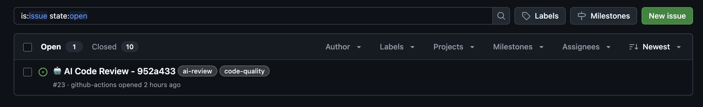
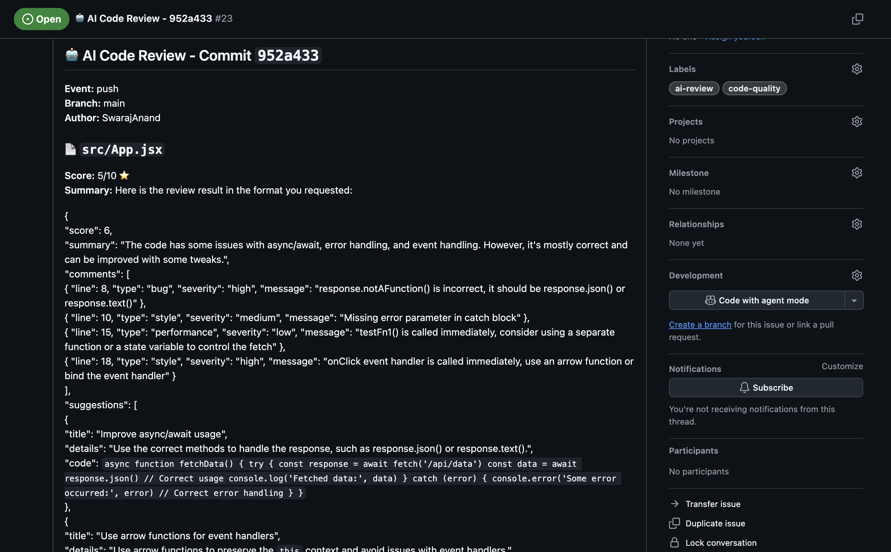

# 🤖 AI Code Review – GitHub Action

This repository contains a **GitHub Actions workflow** that performs **AI-powered code reviews** on every `push` on every branch.  
It uses **Groq's Llama 3 model** to analyze changed files, provide feedback, and automatically post results to your repository.

---

## 🚀 Features

- 🔍 Automatically analyzes **changed files**.
- 💡 Provides:
  - **Score (1–10)** for each file.
  - **Summary of the review.**
  - **Detailed comments** categorized as:
    - `bug`
    - `performance`
    - `style`
    - `security`
- 📝 Posts findings as:
  - **Inline PR comments** (when triggered on pull requests).
  - **GitHub Issues** (when triggered on pushes).
- 🛡️ Supports multiple languages:  
  `JavaScript, TypeScript, Python, Java, C, C++, C#, Go, Rust, PHP, Ruby, YAML`.

---

## 📂 Workflow File

The workflow file is located at `.github/workflows/ai-code-review.yml`.

### Trigger Events
- **Pull Requests** → `opened`, `synchronize`, `reopened`  
- **Pushes** → All branches (`"**"`)

### Workflow Steps

1. **Checkout Code**
   Fetches repository code.
2. **Setup Node.js**
   Installs Node.js 18 runtime.
3. **Install Dependencies**
   Installs `@octokit/rest` and `axios`.
4. **Get Changed Files**
   Detects modified files (`.js, .ts, .java, .py, .cpp, .yml`, etc.).
5. **Debug Context**
   Prints GitHub context for troubleshooting.
6. **Run AI Code Review**
   - Sends changed files to Groq API.
   - Gets back JSON feedback:
     ```json
     {
       "score": 7,
       "summary": "Good code but missing error handling.",
       "comments": [
         { "line": 12, "type": "bug", "severity": "high", "message": "Unhandled exception possible" }
       ],
       "suggestions": [
         { "title": "Add error handling", "details": "Wrap fetch in try/catch", "code": "try { ... } catch(e) { ... }" }
       ]
     }
     ```
   - Posts results as:
     - Inline PR comments
     - GitHub Issues on pushes

---

## 🔑 Required Secrets

To use this workflow, you need to configure secrets in your GitHub repository:

1. **`GITHUB_TOKEN`**  
   - Automatically available in every GitHub Actions run.  
   - Used to post PR comments and create issues.

2. **`GROQ_API_KEY`**  
   - Get from [Groq](https://groq.com).  
   - Store it as a secret in your repository.

---

## 🛠️ Setup Instructions in GitHub

1. **Create workflow file**
   ```bash
   mkdir -p .github/workflows
   nano .github/workflows/ai-code-review.yml


# 🔑 How to Add GitHub Secrets (for Actions)

## Steps

1. Go to your GitHub repository → **Settings** → **Secrets and variables** → **Actions**  
2. Click **New repository secret**  
3. Enter the **Name** (example: `GROQ_API_KEY`) and **Value** (your actual API key)  
4. Click **Add secret**  
5. In your GitHub Actions `.yml` workflow, use the secret like this:

```yaml
env:
  GROQ_API_KEY: ${{ secrets.GROQ_API_KEY }}

```


---

## 📸 Screenshots

### ✅ GitHub Actions Run once you push and code reviewed


### 🔍 AI Review Output


---


```

🤝 Contributing 
Pull requests are welcome!  
For major changes, please open an issue first to discuss what you’d like to change.

```